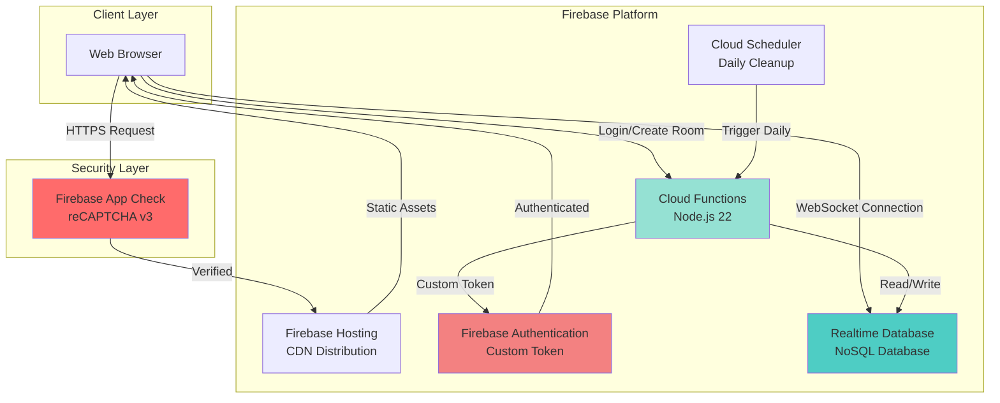
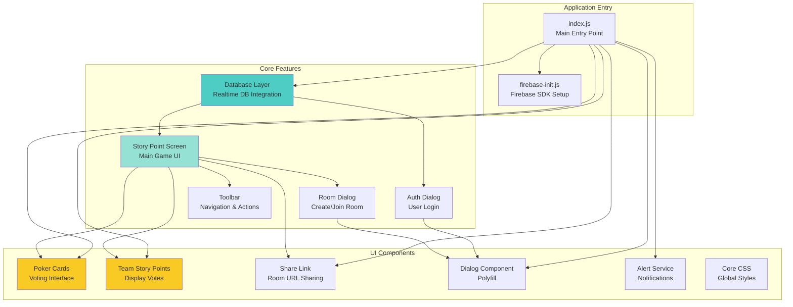
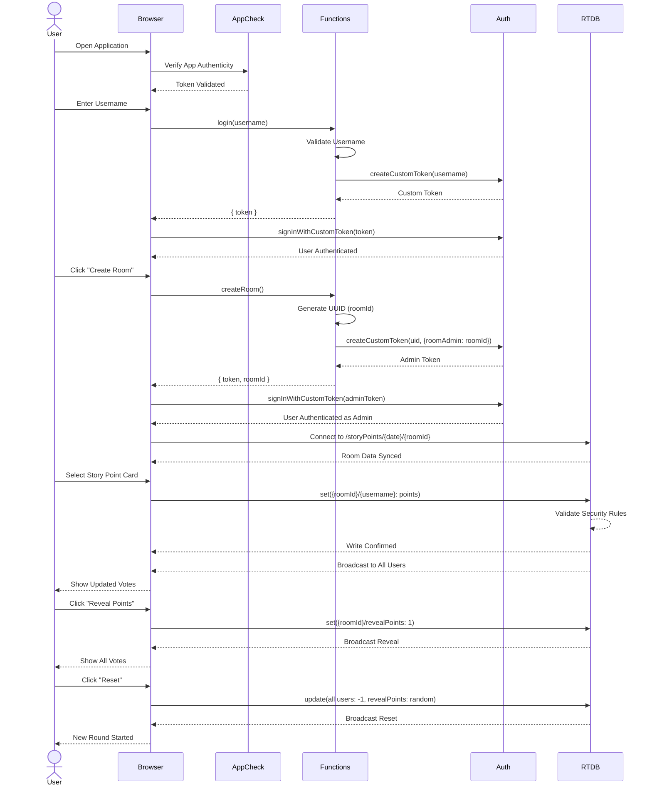

# Agile Poker

[](https://github.com/poly-glot/agile-poker/actions)
[](https://codecov.io/gh/poly-glot/agile-poker)
[](https://percy.io/328a6753/agile-poker)
[](https://dashboard.cypress.io/projects/coqb3r/runs)
[](https://deepscan.io/dashboard#view=project&tid=8408&pid=10623&bid=149386)
[](https://codeclimate.com/github/poly-glot/agile-poker/maintainability)
[](https://gitpod.io/#https://github.com/poly-glot/agile-poker)

**Live Application:** [https://agile.junaid.guru](https://agile.junaid.guru)

A serverless, real-time Planning Poker application built on Firebase Cloud that makes Agile team story estimation efficient, collaborative, and fun.

## Table of Contents

- [What is Planning Poker?](#what-is-planning-poker)
- [Key Features](#key-features)
- [Architecture](#architecture)
  - [System Architecture](#system-architecture)
  - [Component Architecture](#component-architecture)
  - [User Journey Flow](#user-journey-flow)
- [Data Model](#data-model)
- [Technology Stack](#technology-stack)
- [Security Features](#security-features)
- [Getting Started](#getting-started)
  - [Prerequisites](#prerequisites)
  - [Installation](#installation)
  - [Running Locally](#running-locally)
  - [Running Tests](#running-tests)
  - [Building for Production](#building-for-production)
- [Project Structure](#project-structure)
- [Scripts Reference](#scripts-reference)
- [Deployment](#deployment)
- [Dependencies](#dependencies)
- [Performance & Scalability](#performance--scalability)
- [Browser Support](#browser-support)
- [License](#license)

---

## What is Planning Poker?

Planning Poker (also known as Scrum Poker or Agile Poker) is a consensus-based, gamified technique for estimating the effort or relative size of development goals in software development. Team members make estimates by playing numbered cards face-down on the table, instead of speaking them aloud. The cards are revealed simultaneously, and estimates are then discussed.

This application provides a digital, real-time implementation of Planning Poker, enabling distributed teams to estimate stories effectively from anywhere in the world.

## Key Features

- **Real-time Collaboration**: Live updates as team members join and vote
- **Anonymous Voting**: See votes only after all team members have voted or when the moderator reveals them
- **Room-based Sessions**: Create unique rooms for different estimation sessions
- **Automatic Cleanup**: Daily scheduled cleanup of old session data
- **Serverless Architecture**: Built entirely on Firebase Cloud Platform
- **Zero Setup**: No registration required - just enter your name and start
- **Mobile Responsive**: Works seamlessly on desktop, tablet, and mobile devices
- **Secure**: Protected by Firebase App Check with reCAPTCHA v3
- **Share Links**: Easy room sharing via URLs
- **Custom Story Points**: Support for Fibonacci sequence (1, 2, 3, 5, 8, 13, 21, ?) and special cards (Coffee break)

---

## Architecture

### System Architecture

The application follows a serverless architecture pattern, leveraging Firebase services for all backend functionality.



**Key Components:**

- **Firebase Hosting**: Serves the static web application with global CDN distribution
- **Firebase App Check**: Enforces security by ensuring requests come from legitimate clients
- **Cloud Functions**: Serverless backend for authentication and room management
  - `login`: Creates custom authentication tokens for users
  - `createRoom`: Generates unique room IDs and admin tokens
  - `cleanup`: Scheduled function that removes old session data daily
- **Firebase Authentication**: Custom token-based authentication system
- **Realtime Database**: NoSQL database for real-time synchronization of votes and room state
- **Cloud Scheduler**: Triggers daily cleanup jobs to remove stale data

### Component Architecture

The frontend follows a modular, component-based architecture using vanilla JavaScript.



**Component Responsibilities:**

- **Database Layer**: Manages all Firebase Realtime Database operations, authentication, and state synchronization
- **Auth Dialog**: Handles user authentication with username validation
- **Room Dialog**: Manages room creation and joining workflows
- **Story Point Screen**: Main application screen coordinating all voting activities
- **Poker Cards**: Interactive card selection interface for voting
- **Team Story Points**: Real-time display of team member votes
- **Share Link**: Generates and displays shareable room URLs
- **Toolbar**: Navigation and room management actions (reveal, reset, hide)
- **Alert Service**: Accessible notifications for user feedback

### User Journey Flow

This diagram shows the complete user interaction flow from login to voting.



---

## Data Model

The application uses Firebase Realtime Database with a date-partitioned structure for automatic cleanup.

### Database Structure

```
storyPoints/
└── {yearMonthDay}            # e.g., "20260206"
    └── {roomId}              # UUID v4 format
        ├── {username1}: -1   # -1 = not voted yet
        ├── {username2}: 5    # Voted 5 points
        ├── {username3}: 8    # Voted 8 points
        └── revealPoints: 1   # 1 = revealed, -1 = hidden, < -1 = reset trigger
```

### Field Descriptions

| Field | Type | Description |
|-------|------|-------------|
| `yearMonthDay` | String | UTC date in format YYYYMMDD (e.g., "20260206") |
| `roomId` | String | UUID v4 format (e.g., "a1b2c3d4-e5f6-g7h8-i9j0-k1l2m3n4o5p6") |
| `username` | String | User's display name (alphanumeric, max 32 chars) |
| `points` | Number | Story points (-1 = not voted, 0-100 = actual vote) |
| `revealPoints` | Number | Control flag (1 = show votes, -1 = hide, < -1 = reset) |

### Security Rules

The database enforces the following security rules:

- **Read Access**: Only authenticated users can read room data
- **Write Access**:
  - Users can only write their own story points
  - Room admins can write to `revealPoints` field
  - Room admins can reset any user's vote to -1
- **Validation**:
  - `yearMonthDay` must match pattern `20YYMMDD`
  - `roomId` must be valid UUID v4
  - Story points must be numeric values

---

## Technology Stack

### Frontend

| Technology | Version | Purpose |
|------------|---------|---------|
| **Vanilla JavaScript** | ES2022 | Core application logic |
| **Webpack** | 5.97.1 | Module bundler and build tool |
| **Babel** | 7.26.0 | JavaScript transpilation for browser compatibility |
| **CSS3** | - | Styling with CSS custom properties |
| **PostCSS** | 8.4.49 | CSS processing with autoprefixer |
| **dialog-polyfill** | 0.5.6 | Dialog element polyfill for older browsers |
| **focus-visible** | 5.2.0 | Improved keyboard focus indicators |

### Backend

| Technology | Version | Purpose |
|------------|---------|---------|
| **Node.js** | 22 | Runtime for Cloud Functions |
| **Firebase Cloud Functions** | 6.2.0 | Serverless backend logic |
| **Firebase Admin SDK** | 13.0.2 | Server-side Firebase operations |
| **uuid** | 11.0.5 | UUID generation for room IDs |

### Firebase Services

| Service | Purpose |
|---------|---------|
| **Firebase Hosting** | Static web hosting with global CDN |
| **Firebase Authentication** | Custom token-based authentication |
| **Firebase Realtime Database** | Real-time NoSQL database |
| **Firebase Cloud Functions** | Serverless compute (Gen 2) |
| **Firebase App Check** | Application attestation and protection |
| **Cloud Scheduler** | Scheduled cleanup jobs |

### Development & Testing

| Tool | Version | Purpose |
|------|---------|---------|
| **Jest** | 29.7.0 | Unit and integration testing |
| **Cypress** | 13.17.0 | End-to-end testing |
| **Percy** | 1.30.0 | Visual regression testing |
| **ESLint** | 8.57.1 | JavaScript linting |
| **Stylelint** | 16.12.0 | CSS linting |
| **Husky** | 9.1.7 | Git hooks |
| **Firebase Emulators** | - | Local development environment |

---

## Security Features

The application implements multiple layers of security to protect against abuse and ensure data integrity.

### 1. Firebase App Check

- **Implementation**: reCAPTCHA v3 provider
- **Enforcement**: All Cloud Functions require valid App Check tokens
- **Protection**: Prevents unauthorized API calls from non-browser clients

### 2. Database Security Rules

```json
{
  "rules": {
    ".read": false,
    ".write": false,
    "storyPoints": {
      "$yearMonthDay": {
        ".validate": "$yearMonthDay.matches(/^20[0-9]{2}(0[1-9]|1[0-2])(0[1-9]|[12][0-9]|3[01])$/)",
        "$uniqueRoom": {
          ".validate": "$uniqueRoom.matches(/^[\\w]{8}(-[\\w]{4}){3}-[\\w]{12}$/)",
          ".read": "auth != null",
          "$name": {
            ".validate": "newData.isNumber()",
            ".write": "auth != null && ((auth.uid == $name) || ($name == 'revealPoints' && auth.token.roomAdmin == $uniqueRoom) || (newData.val() == -1 && auth.token.roomAdmin == $uniqueRoom))"
          }
        }
      }
    }
  }
}
```

**Key Protections:**
- Default deny-all policy
- Date format validation
- UUID format validation
- User can only write their own votes
- Only room admins can reveal/reset points

### 3. Content Security Policy (CSP)

Implemented via Firebase Hosting headers:

```
Content-Security-Policy:
  default-src 'self' https://agile.junaid.guru;
  script-src 'self' https://www.gstatic.com https://www.google.com;
  connect-src 'self' https://*.firebaseio.com https://*.googleapis.com wss://*.firebaseio.com;
  frame-src https://www.google.com;
  object-src 'none';
  base-uri 'self';
  form-action 'self';
  frame-ancestors 'none'
```

### 4. Additional Security Headers

- **X-Content-Type-Options**: `nosniff` - Prevents MIME type sniffing
- **X-Frame-Options**: `DENY` - Prevents clickjacking attacks
- **X-XSS-Protection**: `1; mode=block` - Enables browser XSS filtering
- **Referrer-Policy**: `strict-origin-when-cross-origin` - Controls referrer information
- **Permissions-Policy**: Disables geolocation, microphone, and camera

### 5. Input Validation

**Username Validation:**
- Maximum 32 characters
- Alphanumeric, spaces, hyphens, and underscores only
- Reserved keywords blocked (e.g., "revealPoints")
- Pattern: `/^[a-z\d\-_\s]+$/i`

### 6. Rate Limiting & Monitoring

- Cloud Functions max-instances configuration prevents resource exhaustion
- Firebase Realtime Database usage monitoring alerts on abnormal patterns
- Automatic connection limits (200k concurrent on Blaze plan)

---

## Getting Started

### Prerequisites

Before you begin, ensure you have the following installed:

- **Node.js**: Version 22 or higher ([Download](https://nodejs.org/))
- **npm**: Comes with Node.js (version 10.8.0+)
- **Firebase CLI**: Install globally
  ```bash
  npm install -g firebase-tools
  ```
- **Java 11**: Required for Firebase emulators ([SDKMAN](https://sdkman.io/))
  ```bash
  sdk install java 11.0.14-zulu
  ```

### Installation

1. **Clone the repository:**
   ```bash
   git clone https://github.com/poly-glot/agile-poker.git
   cd agile-poker
   ```

2. **Install root dependencies:**
   ```bash
   npm install
   ```

3. **Install Cloud Functions dependencies:**
   ```bash
   cd functions
   npm install
   cd ..
   ```

4. **Login to Firebase (optional for local development):**
   ```bash
   firebase login
   ```

### Running Locally

The application uses Firebase Emulators for local development, eliminating the need for a live Firebase project.

**Start the development server:**
```bash
npm start
```

This command will:
- Start Firebase Emulators (Auth, Database, Functions, Hosting)
- Launch Webpack Dev Server with hot module replacement
- Open the application at `http://localhost:5002`
- Open Emulator UI at `http://localhost:4000`

**Emulator Ports:**
- **Hosting**: 5002
- **Functions**: 5001
- **Auth**: 9099
- **Database**: 9001
- **Emulator UI**: 4000

### Running Tests

The project includes comprehensive test coverage with Jest and Cypress.

**Run all tests:**
```bash
npm test
```

**Run tests in watch mode:**
```bash
npm run test:watch
```

**Generate coverage report:**
```bash
npm run test:coverage
```

**Run end-to-end tests:**
```bash
npm run cy:run
```

**Open Cypress interactive mode:**
```bash
npm run cy:open
```

**Run visual regression tests (Percy):**
```bash
npm run percy
```

**Update Jest snapshots:**
```bash
npm run test:snapshot
```

### Building for Production

**Create production build:**
```bash
npm run build
```

This will:
- Bundle and minify JavaScript
- Optimize CSS with autoprefixer and minification
- Generate source maps
- Output to `/dist` directory
- Apply tree-shaking for smaller bundle sizes

**Preview production build locally:**
```bash
cd dist
npx serve
```

---

## Project Structure

```
agile-poker/
├── public/                      # Static assets
│   ├── assets/                  # Images and icons
│   │   ├── loading.gif
│   │   ├── social.jpg
│   │   └── tick.svg
│   └── index.html               # HTML template
│
├── src/                         # Source code
│   ├── component/               # Reusable UI components
│   │   ├── alert/               # Accessible notification system
│   │   ├── core-css/            # Global styles and CSS variables
│   │   ├── dialog/              # Dialog component with polyfill
│   │   ├── poker-cards/         # Voting card interface
│   │   ├── share-link/          # Room URL sharing component
│   │   ├── team-story-points/   # Team votes display
│   │   ├── test-example/        # Testing examples
│   │   └── utils/               # Shared utilities
│   │
│   ├── features/                # Feature modules
│   │   ├── auth-dialog/         # User authentication UI
│   │   ├── database/            # Firebase DB integration
│   │   ├── room-dialog/         # Room creation/join UI
│   │   ├── story-point-screen/  # Main application screen
│   │   └── toolbar/             # Application toolbar
│   │
│   ├── firebase-init.js         # Firebase SDK initialization
│   └── index.js                 # Application entry point
│
├── functions/                   # Cloud Functions
│   ├── index.js                 # Functions implementation
│   ├── functions.test.js        # Functions unit tests
│   └── package.json             # Functions dependencies
│
├── cypress/                     # E2E tests
│   ├── fixtures/                # Test data
│   ├── integration/             # Test specs
│   ├── plugins/                 # Cypress plugins
│   └── support/                 # Custom commands
│
├── load-testing/                # Performance tests
│   ├── src/
│   │   └── main.perf.ts         # Load test scenarios
│   ├── element.config.js
│   └── package.json
│
├── __mocks__/                   # Jest mocks
│   ├── fileMock.js
│   └── styleMock.js
│
├── database.rules.json          # Realtime Database security rules
├── firebase.json                # Firebase configuration
├── webpack.js                   # Webpack configuration
├── postcss.config.js            # PostCSS configuration
├── package.json                 # Project dependencies
└── README.MD                    # This file
```

---

## Scripts Reference

### Development Scripts

| Script | Command | Description |
|--------|---------|-------------|
| **start** | `npm start` | Start development server with Firebase emulators |
| **serve** | `npm run serve` | Start only Firebase emulators (no webpack) |
| **build** | `npm run build` | Create production build in `/dist` |

### Testing Scripts

| Script | Command | Description |
|--------|---------|-------------|
| **test** | `npm test` | Run all Jest tests with emulators |
| **test:watch** | `npm run test:watch` | Run tests in watch mode |
| **test:coverage** | `npm run test:coverage` | Generate coverage report |
| **test:snapshot** | `npm run test:snapshot` | Update Jest snapshots |
| **cy:open** | `npm run cy:open` | Open Cypress interactive mode |
| **cy:run** | `npm run cy:run` | Run Cypress tests headless |
| **percy** | `npm run percy` | Run visual regression tests |

### Code Quality Scripts

| Script | Command | Description |
|--------|---------|-------------|
| **lint:js** | `npm run lint:js` | Lint and fix JavaScript files |
| **lint:css** | `npm run lint:css` | Lint and fix CSS files |
| **precommit** | `npm run precommit` | Run pre-commit hooks (automatic) |

### Git Hooks (Husky)

- **pre-commit**: Runs `lint-staged` to lint staged files
- **pre-push**: Runs all tests to ensure code quality

---

## Deployment

The application uses GitHub Actions for continuous deployment to Firebase.

### Manual Deployment

**Deploy everything:**
```bash
firebase deploy
```

**Deploy only hosting:**
```bash
firebase deploy --only hosting
```

**Deploy only functions:**
```bash
firebase deploy --only functions
```

**Deploy only database rules:**
```bash
firebase deploy --only database
```

### CI/CD Pipeline

The repository includes a GitHub Actions workflow that automatically:
1. Runs linting checks
2. Executes all tests
3. Generates coverage reports
4. Runs visual regression tests
5. Builds the application
6. Deploys to Firebase Hosting and Functions

**Workflow triggers:**
- Push to `main` branch
- Pull request to `main` branch

### Environment Configuration

For production deployment, ensure the following Firebase project settings are configured:

1. **Firebase App Check**: Register your domain with reCAPTCHA v3
2. **Cloud Functions**: Set max-instances to prevent cost overruns
3. **Database Rules**: Deploy from `database.rules.json`
4. **Hosting Headers**: Configured in `firebase.json`
5. **Cloud Scheduler**: Enable and configure daily cleanup job

---

## Dependencies

### Production Dependencies

| Package | Version | Purpose |
|---------|---------|---------|
| firebase | ^11.3.0 | Firebase client SDK |
| dialog-polyfill | ^0.5.6 | Dialog element support for older browsers |
| focus-visible | ^5.2.0 | Polyfill for :focus-visible CSS selector |
| lodash.debounce | ^4.0.8 | Debounce utility for performance optimization |
| uuid | ^11.0.5 | UUID generation for unique room IDs |

### Development Dependencies (Key Highlights)

| Package | Version | Purpose |
|---------|---------|---------|
| webpack | ^5.97.1 | Module bundler |
| @babel/core | ^7.26.0 | JavaScript compiler |
| jest | ^29.7.0 | Testing framework |
| cypress | ^13.17.0 | E2E testing framework |
| @percy/cypress | ^3.1.0 | Visual regression testing |
| eslint | ^8.57.1 | JavaScript linter |
| stylelint | ^16.12.0 | CSS linter |
| firebase-admin | ^13.0.2 | Admin SDK for testing |
| firebase-functions | ^6.2.0 | Cloud Functions SDK |
| @firebase/rules-unit-testing | ^4.0.1 | Database rules testing |
| husky | ^9.1.7 | Git hooks |
| lint-staged | ^15.3.0 | Pre-commit linting |

### Cloud Functions Dependencies

| Package | Version | Purpose |
|---------|---------|---------|
| firebase-admin | ^13.0.2 | Firebase Admin SDK for server operations |
| firebase-functions | ^6.2.0 | Cloud Functions framework (Gen 2) |
| uuid | ^11.0.5 | UUID generation for rooms |

---

## Performance & Scalability

### Load Testing Results

The application has been thoroughly load tested to ensure it can handle production traffic.

**Test Results:**
- **Concurrent Users**: 1000+ simultaneous users
- **Total Requests**: 40,000+ requests during test period
- **Response Time**: < 200ms average
- **Error Rate**: 0%
- **Test Platform**: [Flood.io](https://app.flood.io/28CLJ92Tg10MkW9bWbxtwV4TiDG)

### Scalability Considerations

1. **Firebase Realtime Database**:
   - Supports up to **200,000 concurrent connections** on Blaze Plan
   - Automatic scaling without configuration
   - Global replication available

2. **Cloud Functions**:
   - Configured with max-instances to prevent cost overruns
   - Auto-scales based on request volume
   - Cold start optimization with Gen 2 functions

3. **Firebase Hosting**:
   - Global CDN distribution
   - Automatic SSL certificates
   - HTTP/2 support

4. **Data Management**:
   - Daily cleanup job removes old session data
   - Date-partitioned structure improves query performance
   - Indexed database paths for optimal reads

### Performance Optimizations

- **Code Splitting**: Webpack dynamic imports for lazy loading
- **CSS Optimization**: Minification, autoprefixing, and tree-shaking
- **JavaScript Bundling**: Terser minification with tree-shaking
- **Debounced Updates**: Real-time updates debounced to 200ms
- **Asset Caching**: Aggressive caching headers for static assets
- **Preload Critical Resources**: Webpack preload plugin for fonts and critical CSS

---

## Browser Support

The application supports the **2 most recent versions** of the following browsers:

- Google Chrome
- Mozilla Firefox
- Apple Safari
- Microsoft Edge

**Browserslist Configuration:**
```json
[
  "last 2 chrome versions",
  "last 2 safari versions"
]
```

**Polyfills Included:**
- Dialog element (dialog-polyfill)
- :focus-visible CSS selector (focus-visible)

---

## License

This project is licensed under the MIT License. See the [LICENSE](LICENSE) file for details.

---

## Contributing

Contributions are welcome! Please follow these guidelines:

1. Fork the repository
2. Create a feature branch (`git checkout -b feature/amazing-feature`)
3. Commit your changes with conventional commits
4. Ensure all tests pass (`npm test`)
5. Push to your fork and submit a Pull Request

**Code Quality Requirements:**
- ESLint checks must pass
- Stylelint checks must pass
- Test coverage must remain above 85%
- All tests must pass

---

## Support & Documentation

- **Live Demo**: [https://agile.junaid.guru](https://agile.junaid.guru)
- **GitHub Repository**: [https://github.com/poly-glot/agile-poker](https://github.com/poly-glot/agile-poker)
- **Issue Tracker**: [GitHub Issues](https://github.com/poly-glot/agile-poker/issues)
- **Firebase Documentation**: [Firebase Docs](https://firebase.google.com/docs)

---

**Built with Firebase Cloud Platform**
