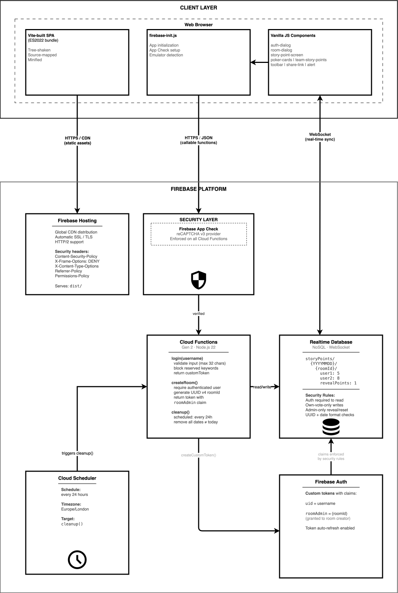
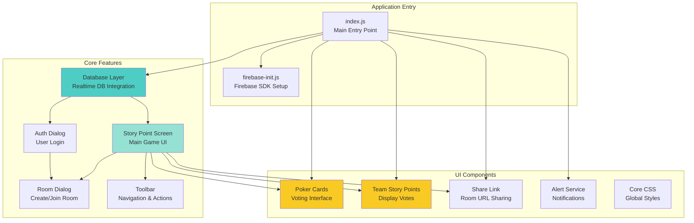
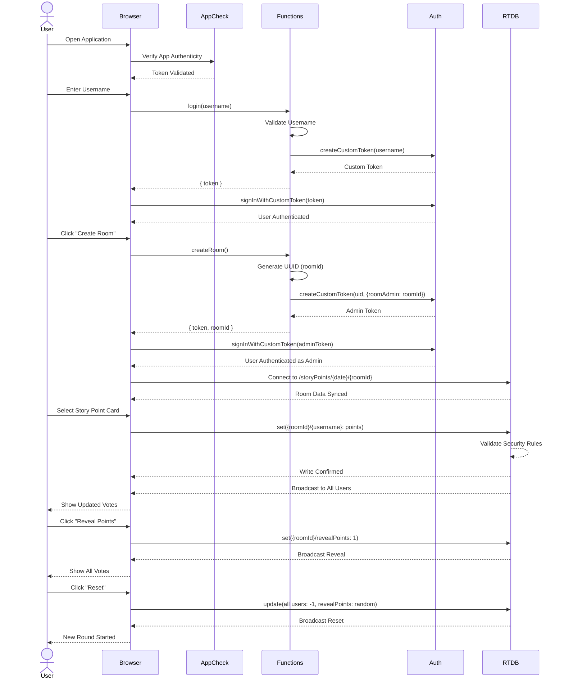

# Agile Poker

[](https://github.com/poly-glot/agile-poker/actions)
[](https://codecov.io/gh/poly-glot/agile-poker)
[](https://percy.io/328a6753/agile-poker)
[](https://dashboard.cypress.io/projects/coqb3r/runs)
[](https://deepscan.io/dashboard#view=project&tid=8408&pid=10623&bid=149386)

**Live Application:** [https://agile.junaid.guru](https://agile.junaid.guru)

A serverless, real-time Planning Poker application built on Firebase. Teams can estimate stories collaboratively from anywhere -- no sign-up required.

---

## Table of Contents

1. [What is Planning Poker?](#what-is-planning-poker)
2. [Key Features](#key-features)
3. [Quick Start](#quick-start)
4. [Architecture](#architecture)
5. [Data Model](#data-model)
6. [Technology Stack](#technology-stack)
7. [Security](#security)
8. [Project Structure](#project-structure)
9. [Scripts Reference](#scripts-reference)
10. [Deployment](#deployment)
11. [Performance](#performance)
12. [Browser Support](#browser-support)
13. [Contributing](#contributing)
14. [License](#license)

---

## What is Planning Poker?

Planning Poker is a consensus-based estimation technique used in Agile software development. Team members independently select a card representing their effort estimate, then reveal all cards simultaneously. This avoids anchoring bias and encourages discussion when estimates differ.

This application provides a digital, real-time version of Planning Poker for distributed teams.

---

## Key Features

| Feature | Description |
|---------|-------------|
| **Real-time collaboration** | Live updates as team members join and vote |
| **Anonymous voting** | Votes stay hidden until the moderator reveals them |
| **Room-based sessions** | Each estimation session gets a unique room URL |
| **Zero sign-up** | Enter a display name and start -- no account needed |
| **Mobile responsive** | Works on desktop, tablet, and mobile |
| **Automatic cleanup** | A daily scheduled job removes stale session data |
| **Secure** | Firebase App Check with reCAPTCHA v3, strict database rules |
| **Shareable links** | One-click room URL sharing |
| **Modified Fibonacci scale** | Card values: ?, 1, 2, 3, 5, 8, 13, 20, 40, 100 |

---

## Quick Start

### Prerequisites

| Requirement | Version | Notes |
|-------------|---------|-------|
| **Node.js** | 22+ | [Download](https://nodejs.org/) |
| **npm** | 10.8.0+ | Comes with Node.js |
| **Firebase CLI** | Latest | `npm install -g firebase-tools` |
| **Java** | 11+ | Required for Firebase emulators ([SDKMAN](https://sdkman.io/)) |

### 1. Clone and install

```bash
git clone https://github.com/poly-glot/agile-poker.git
cd agile-poker

# Install root dependencies
npm install

# Install Cloud Functions dependencies
cd functions && npm install && cd ..
```

### 2. Start the development server

```bash
npm start
```

This starts Firebase emulators and the Vite dev server together. Once running:

| Service | URL |
|---------|-----|
| **Application** | http://localhost:5173 |
| **Emulator UI** | http://localhost:4000 |

Behind the scenes, the Firebase emulators run on these ports:

| Emulator | Port |
|----------|------|
| Hosting | 5002 |
| Functions | 5001 |
| Auth | 9099 |
| Realtime Database | 9001 |

### 3. Run the tests

```bash
npm test
```

See the [Scripts Reference](#scripts-reference) section for more test commands.

### 4. Build for production

```bash
npm run build
```

Output goes to the `dist/` directory. Preview locally with:

```bash
npm run preview
```

---

## Architecture

### System Overview

The application follows a serverless architecture, with Firebase handling all backend concerns.



**How it works:**

1. **Firebase Hosting** serves the Vite-built SPA via a global CDN with strict security headers (CSP, X-Frame-Options, etc.).
2. **Firebase App Check** (reCAPTCHA v3) verifies every Cloud Function call originates from a legitimate browser client.
3. **Cloud Functions** (Gen 2, Node.js 22) expose three callable endpoints:
   - `login(username)` -- validates input, returns a custom auth token with `uid` = username
   - `createRoom()` -- generates a UUID room ID, returns a token with a `roomAdmin` claim
   - `cleanup()` -- scheduled daily, deletes all date partitions except today
4. **Firebase Auth** issues custom tokens carrying claims that the database security rules enforce (e.g. `roomAdmin`).
5. **Realtime Database** maintains a persistent WebSocket to every connected browser, syncing votes and reveal state in real time. Security rules restrict writes to own-vote-only and admin-only controls.
6. **Cloud Scheduler** triggers `cleanup()` every 24 hours (Europe/London timezone).

### Component Architecture

The frontend is built with vanilla JavaScript in a modular, component-based structure.



### User Journey



---

## Data Model

The application uses Firebase Realtime Database with a date-partitioned structure that enables automatic cleanup.

### Database Structure

```
storyPoints/
  {yearMonthDay}/               # e.g. "20260206"
    {roomId}/                   # UUID v4, e.g. "a1b2c3d4-e5f6-..."
      {username1}: -1           # -1 = not voted yet
      {username2}: 5            # voted 5 points
      {username3}: 8            # voted 8 points
      revealPoints: 1           # 1 = revealed, -1 = hidden, < -1 = reset trigger
```

### Field Reference

| Field | Type | Description |
|-------|------|-------------|
| `yearMonthDay` | String | UTC date as `YYYYMMDD` |
| `roomId` | String | UUID v4 |
| `{username}` | Number | `-1` = not voted, `0`--`100` = their estimate |
| `revealPoints` | Number | `1` = show votes, `-1` = hide votes, `< -1` = reset |

### Write Permissions

- A user can only write to their **own** `{username}` key.
- Only the **room admin** can write to `revealPoints`.
- Only the **room admin** can reset any user's vote to `-1`.

---

## Technology Stack

### Frontend

| Technology | Version | Purpose |
|------------|---------|---------|
| Vanilla JavaScript | ES2022 | Application logic |
| Vite | 6.0 | Dev server and build tool |
| PostCSS | 8.4 | CSS processing with autoprefixer |
| focus-visible | 5.2.0 | Keyboard focus indicator polyfill |

### Backend (Cloud Functions)

| Technology | Version | Purpose |
|------------|---------|---------|
| Node.js | 22 | Runtime |
| firebase-functions | 6.2.0 | Cloud Functions framework (Gen 2) |
| firebase-admin | 13.0.2 | Server-side Firebase operations |
| uuid | 11.0.5 | Room ID generation |

### Firebase Services

| Service | Purpose |
|---------|---------|
| Hosting | Static web hosting with global CDN |
| Authentication | Custom token-based auth |
| Realtime Database | Real-time NoSQL data sync |
| Cloud Functions | Serverless compute (Gen 2) |
| App Check | reCAPTCHA v3 verification |
| Cloud Scheduler | Daily cleanup jobs |

### Testing

| Tool | Version | Purpose |
|------|---------|---------|
| Vitest | 3.0 | Unit and integration tests |
| Cypress | 13.17.0 | End-to-end tests |
| Percy | 1.30.0 | Visual regression tests |
| @vitest/coverage-v8 | 3.0 | Code coverage |
| @firebase/rules-unit-testing | 4.0.1 | Database rules tests |

### Code Quality

| Tool | Version | Purpose |
|------|---------|---------|
| ESLint | 8.57.1 | JavaScript linting |
| Stylelint | 16.12.0 | CSS linting |
| Husky | 9.1.7 | Git hooks |
| lint-staged | 15.3.0 | Pre-commit lint runner |

---

## Security

The application implements multiple layers of security.

### App Check

- **Provider:** reCAPTCHA v3
- **Enforcement:** All Cloud Functions require a valid App Check token.
- **Effect:** Blocks unauthorized API calls from non-browser clients.

### Database Security Rules

Defined in `database.rules.json`:

```json
{
  "rules": {
    ".read": false,
    ".write": false,
    "storyPoints": {
      "$yearMonthDay": {
        ".validate": "$yearMonthDay.matches(/^20[0-9]{2}(0[1-9]|1[0-2])(0[1-9]|[12][0-9]|3[01])$/)",
        "$uniqueRoom": {
          ".validate": "$uniqueRoom.matches(/^[\\w]{8}(-[\\w]{4}){3}-[\\w]{12}$/)",
          ".read": "auth != null",
          "$name": {
            ".validate": "newData.isNumber()",
            ".write": "auth != null && ((auth.uid == $name) || ($name == 'revealPoints' && auth.token.roomAdmin == $uniqueRoom) || (newData.val() == -1 && auth.token.roomAdmin == $uniqueRoom))"
          }
        }
      }
    }
  }
}
```

**What the rules enforce:**

| Rule | Description |
|------|-------------|
| Default deny | All reads and writes are denied unless explicitly allowed |
| Date validation | `yearMonthDay` must match `20YYMMDD` format |
| Room ID validation | Must be a valid UUID v4 |
| Auth required | Only authenticated users can read room data |
| Own-vote-only writes | Users can only update their own vote |
| Admin-only controls | Only room admin can reveal/reset votes |

### HTTP Security Headers

Configured in `firebase.json` and applied by Firebase Hosting:

| Header | Value | Purpose |
|--------|-------|---------|
| Content-Security-Policy | Strict allowlist | Controls which resources the browser can load |
| X-Content-Type-Options | `nosniff` | Prevents MIME type sniffing |
| X-Frame-Options | `DENY` | Prevents clickjacking |
| X-XSS-Protection | `1; mode=block` | Browser XSS filter |
| Referrer-Policy | `strict-origin-when-cross-origin` | Controls referrer information |
| Permissions-Policy | Disables geolocation, microphone, camera | Restricts browser APIs |

### Input Validation

**Username rules:**

- Max 32 characters
- Allowed characters: letters, numbers, spaces, hyphens, underscores
- Pattern: `/^[a-z\d\-_\s]+$/i`
- Reserved keywords (e.g. `revealPoints`) are blocked

---

## Project Structure

```
agile-poker/
  index.html                    # HTML entry point (Vite root)
  vite.config.js                # Vite + Vitest configuration
  vitest.setup.js               # Test setup file
  firebase.json                 # Firebase project configuration
  database.rules.json           # Realtime Database security rules
  postcss.config.cjs            # PostCSS configuration
  package.json                  # Dependencies and scripts

  src/
    index.js                    # Application entry point
    firebase-init.js            # Firebase SDK initialization

    component/                  # Reusable UI components
      alert/                    #   Accessible notification system
      core-css/                 #   Global styles and CSS variables
      dialog/                   #   Dialog component
      poker-cards/              #   Voting card interface
      share-link/               #   Room URL sharing
      team-story-points/        #   Team votes display
      utils/                    #   Shared utilities

    features/                   # Feature modules
      auth-dialog/              #   Login form
      database/                 #   Firebase Realtime DB integration
      room-dialog/              #   Room creation / join
      story-point-screen/       #   Main voting screen
      toolbar/                  #   Admin toolbar (reveal, reset, etc.)

  functions/                    # Cloud Functions
    index.js                    #   Function implementations
    functions.test.js           #   Function tests
    package.json                #   Function dependencies

  public/                       # Static assets
    assets/
      loading.gif               #   Waiting indicator
      social.jpg                #   Open Graph image
      tick.svg                  #   Done indicator

  cypress/                      # End-to-end tests
    integration/                #   Test specs
    fixtures/                   #   Test data
    plugins/                    #   Cypress plugins
    support/                    #   Custom commands

  load-testing/                 # Performance tests
    src/main.perf.ts            #   Load test scenarios

  __mocks__/                    # Test mocks
    fileMock.js
    styleMock.js
```

---

## Scripts Reference

### Development

| Command                                                   | Description                                |
|-----------------------------------------------------------|--------------------------------------------|
| `npm start`                                               | Start Vite dev server + Firebase emulators |
| `npm run serve`                                           | Start Firebase emulators only (no Vite)    |
| `npm run build`                                           | Production build to `dist/`                |
| `npm run preview`                                         | Preview the production build locally       |
| `devcontainer up`                                         | run dev containers                         |
| `devcontainer exec claude --dangerously-skip-permissions` | exec claude                                |

### Testing

| Command | Description |
|---------|-------------|
| `npm test` | Run all Vitest tests (with emulators) |
| `npm run test:watch` | Run tests in watch mode |
| `npm run test:coverage` | Generate code coverage report |
| `npm run test:snapshot` | Update Vitest snapshots |
| `npm run cy:open` | Open Cypress interactive mode |
| `npm run cy:run` | Run Cypress tests headless |
| `npm run percy` | Run visual regression tests via Percy |

### Code Quality

| Command | Description |
|---------|-------------|
| `npm run lint:js` | Lint and auto-fix JavaScript (ESLint) |
| `npm run lint:css` | Lint and auto-fix CSS (Stylelint) |
| `npm run precommit` | Run lint-staged (runs automatically via Husky) |

### Git Hooks (Husky)

| Hook | Action |
|------|--------|
| `pre-commit` | Runs `lint-staged` on staged files |
| `pre-push` | Runs the full test suite |

---

## Deployment

### CI/CD Pipeline

The GitHub Actions workflow runs on every push or pull request to `main`:

1. Lint checks (JS + CSS)
2. Run all tests
3. Generate coverage report
4. Run visual regression tests
5. Build the application
6. Deploy to Firebase (Hosting + Functions)

### Manual Deployment

```bash
# Deploy everything
firebase deploy

# Deploy only hosting
firebase deploy --only hosting

# Deploy only functions
firebase deploy --only functions

# Deploy only database rules
firebase deploy --only database
```

### Production Checklist

Before deploying to production, verify these are configured:

- [ ] Firebase App Check registered with reCAPTCHA v3 for your domain
- [ ] Cloud Functions `max-instances` set to prevent cost overruns
- [ ] Database rules deployed from `database.rules.json`
- [ ] Hosting headers configured in `firebase.json`
- [ ] Cloud Scheduler enabled for the daily cleanup job

---

## Performance

### Load Testing Results

| Metric | Result |
|--------|--------|
| Concurrent users | 1,000+ |
| Total requests | 40,000+ |
| Average response time | < 200ms |
| Error rate | 0% |

Full results: [Flood.io dashboard](https://app.flood.io/28CLJ92Tg10MkW9bWbxtwV4TiDG)

### Scalability

- **Realtime Database:** Up to 200,000 concurrent connections (Blaze Plan), auto-scaling, global replication available
- **Cloud Functions:** Auto-scales with request volume; `max-instances` caps prevent runaway costs
- **Hosting:** Global CDN, automatic SSL, HTTP/2

### Build Optimizations

- **Vite** provides fast HMR in development and optimized Rollup-based production builds
- **Tree-shaking** removes unused code from the bundle
- **CSS** is minified and autoprefixed via PostCSS
- **Source maps** are generated for production debugging
- **Date-partitioned data** enables efficient queries and cleanup

---

## Browser Support

Supports the **last 2 versions** of:

- Google Chrome
- Apple Safari

Configured via `browserslist` in `package.json`:

```json
["last 2 chrome versions", "last 2 safari versions"]
```

**Polyfills included:**

- `:focus-visible` CSS selector (focus-visible)

---

## Contributing

1. Fork the repository
2. Create a feature branch: `git checkout -b feature/your-feature`
3. Make your changes and commit with conventional commit messages
4. Ensure all checks pass: `npm test && npm run lint:js && npm run lint:css`
5. Push to your fork and open a Pull Request

**Requirements:**

- ESLint and Stylelint checks must pass
- Test coverage must remain above 85%
- All tests must pass

---

## License

MIT -- see [LICENSE](LICENSE) for details.

---

## Links

| Resource | URL |
|----------|-----|
| Live demo | [agile.junaid.guru](https://agile.junaid.guru) |
| Repository | [github.com/poly-glot/agile-poker](https://github.com/poly-glot/agile-poker) |
| Issues | [GitHub Issues](https://github.com/poly-glot/agile-poker/issues) |
| Firebase docs | [firebase.google.com/docs](https://firebase.google.com/docs) |
